# Stereo Camera Depth
_Computational Robotics Computer Vision Project_ - Krishna Suresh and Allyson Hur

## Goal
The goal of this project is to create a simple stereo camera that can produce a depth image. The stereo camera is meant to replicate human binocular vision so it can capture three-dimensional images. The camera model we are using is the OAKD camera, which has two cameras that are parallel to each other. Several of the theories that we researched about the stereo system include the linear camera model and epipolar geometry. The linear camera model is a mathematical representation of how a photo is taken, where points in 3D space of a scene are mapped onto the pixels of a 2D image. Epipolar geometry is useful when the two cameras need to be calibrated in respect to one another. There are several techniques for stereo matching, but the one we decided to implement uses template matching and a similarity metric to find correspondences between the left and right images.

## Method
We researched the theory behind camera calibration, which simplifies to finding the intrinsic and external properties of the camera. The intrinsic properties of the camera help map the perspective projection points in the world onto the image plane, while the external properties include the position of the camera relative to the world coordinate frame. 

Image coordinates ← Camera coordinates ← World coordinates

$$x_i=[x_i ;y_i] ← x_c=[x_c ; y_c; z_c] ← x_w=[x_w ; y_w; z_w]$$

The first method used to calibrate the camera is the linear camera model, which takes a point in 3D space and maps it onto the pixels in the image. This model uses a procedure called the forward imaging model, which maps the 3D world coordinate frame onto the 3D camera coordinate frame, then finally maps the 3D camera coordinate frame onto the 2D image plane. The end result of this step is extracting the projection matrix. The transformation from camera coordinates to image coordinates is called perspective projection, which can be found through the equation below: 

Perspective Projection:
$$u=f_x\frac{x_c}{z_c}+o_x$$
$$v=f_x\frac{y_c}{z_c}+o_y$$

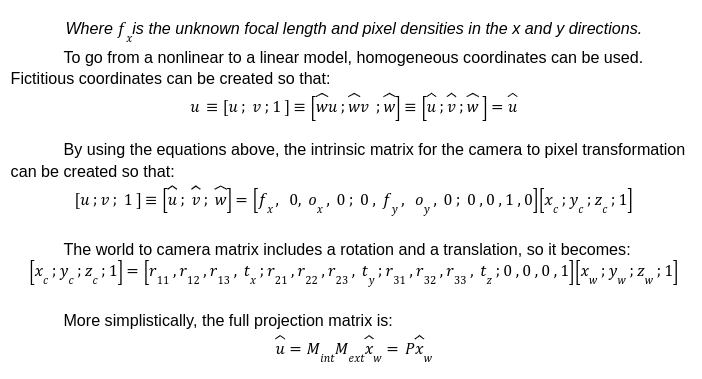

The OAKD camera we used had rectified left and right images, which made creating the depth image more simple since the cameras were already calibrated for us. All the theories behind camera calibration can be applied to a stereo system. A stereo system works by triangulating the two cameras, where a triangle is created with the horizontal displacement between the two cameras and an outgoing ray from each camera. The intersection of the outgoing rays is the location of the scene point relative to the image points.
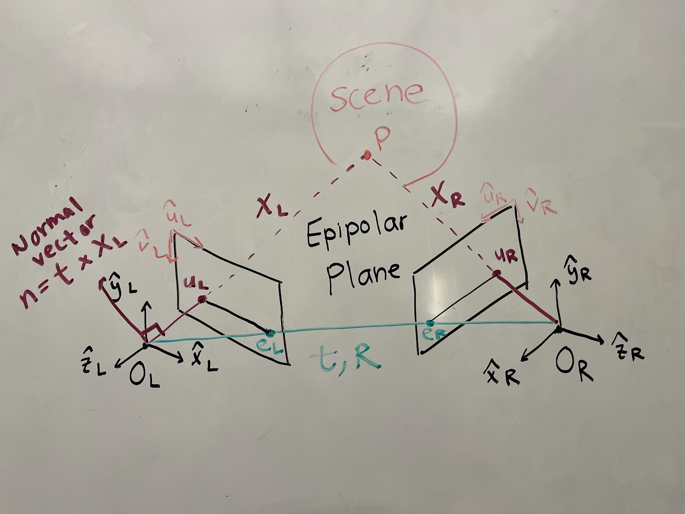
The disparity is the difference between the same scene point in the left and right images, which is inversely proportional to the depth (the closer the point is to the two cameras, the larger the disparity). The disparity can be found with this equation: 
$$Disparity=u_L-u_R$$
Because the disparity only exists in the horizontal direction, the corresponding points must lie on the same line in both images. This method works best with textured surfaces since repeated patterns will result in too many matches between the left and right images. In order to make calculating the disparity as simple as possible, the two cameras must be calibrated so that they are parallel to each other so the scene is at infinity. The disparity is proportional to the baseline, so the larger the baseline, the more precisely the disparity can be calculated. This makes it much easier to calculate the correspondences between the left and right images since the distance between the two cameras becomes negligible. Epipolar geometry can be used to achieve this. 

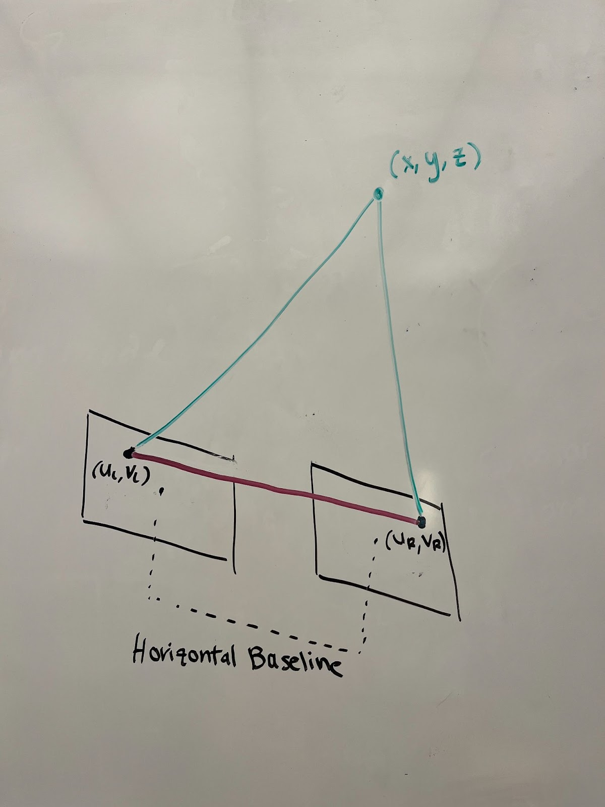

Through epipolar geometry, the goal is to find the fundamental matrix, which encompasses the rotation and translation of the cameras with respect to one another. 
The essential matrix contains the rotation and translation of the cameras with respect to one another:
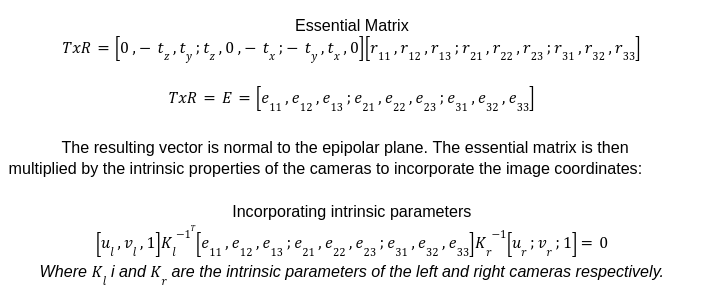

The idea is that the fundamental matrix can be used to find the essential matrix since the intrinsic camera properties are known values, then the essential matrix can be decomposed using singular value decomposition in order to find the translation and rotation.
Once the epipolar lines are parallel, there are multiple ways to determine disparity. Template matching involves matching pixels along the same horizontal line. There are multiple similarity metrics for template matching, including minimum sum of absolute differences, minimum sum of squared differences, and maximum normalized cross-correlation. 

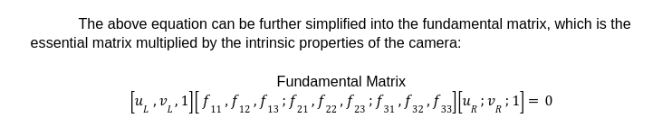

It turned out that it wasn’t necessary to apply some of the above theories that we learned about. Our algorithm was pretty straightforward. After obtaining the rectified left and right images from the OAKD camera, we used the minimum sum of absolute differences similarity metric to find the correspondences between the left and right images. Our algorithm goes row by row, scanning every pixel along the same horizontal line to find a match. 
	After creating successful depth images, we decided to try rectifying the images ourselves instead of taking the rectified images already generated from the OAKD camera. A diagram of the process is shown below:
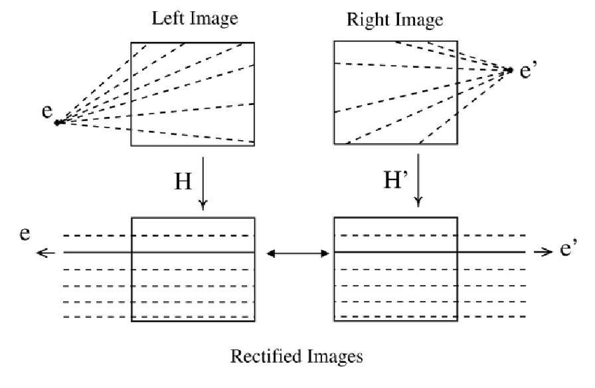

### Design Decision
When approaching how we would actually implement a depth calculation, we found many methods for triangulating the point in space given a correspondence in the two images. However, the challenge of finding correspondences increases with a two dimension search when compared to other approaches which use a one dimension search. In understanding the process of rectification, we learned that points on horizontal scan lines must lie on the same horizontal line in the stereo pair due to the parallel epipolar lines when the image planes are collinear. This makes the correspondence problem far simpler and more reliable to compute. We chose to follow this path as it allowed for more time to dive into the theoretical understanding of stereo depth and quickly connect to a practical implementation.

## Results

### Images Rectification
Raw Stereo

    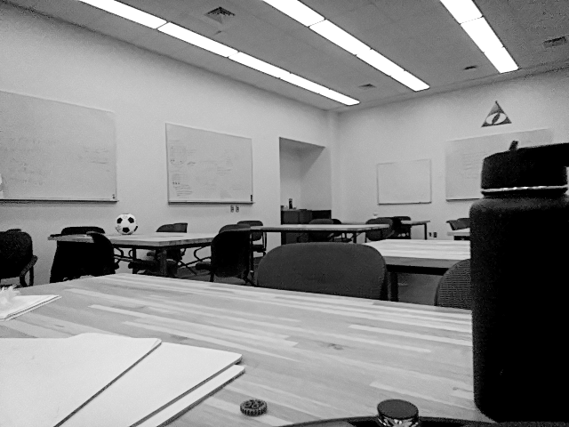
    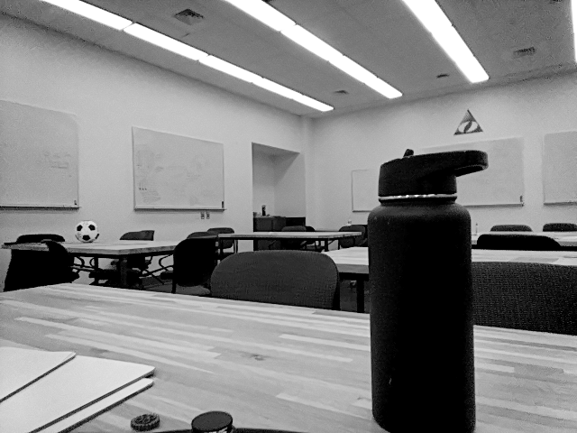

Rectified Stereo

    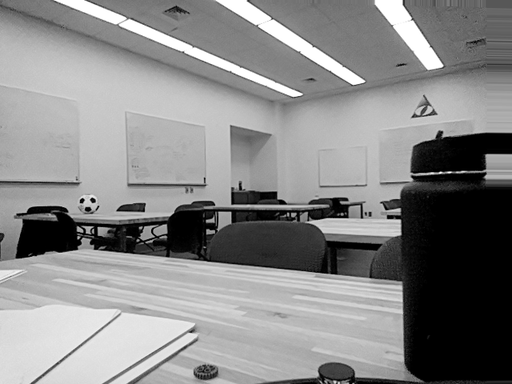
    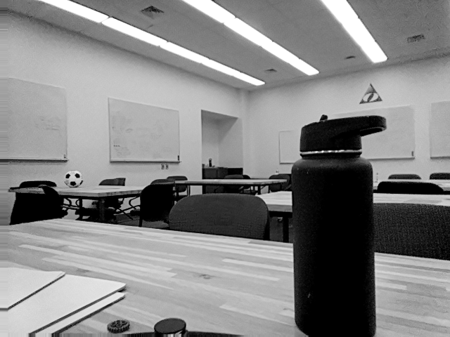

### Comparison of different kernels

3x3:
    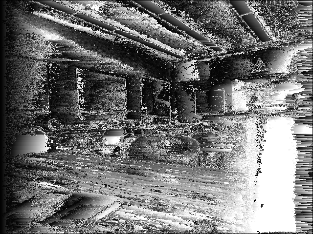
6x6:
    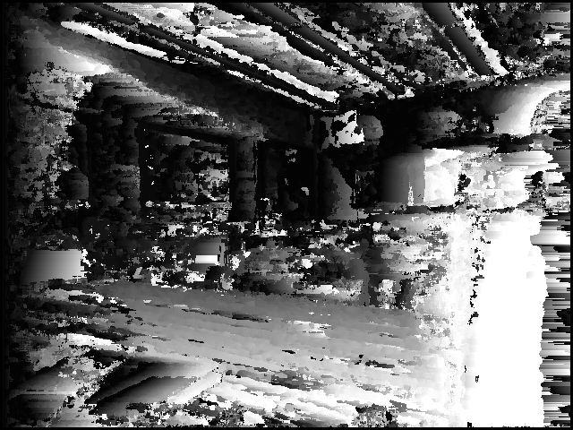
10x10:
    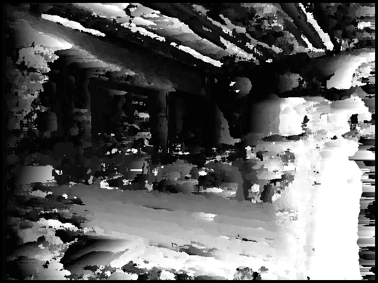
30x30:
    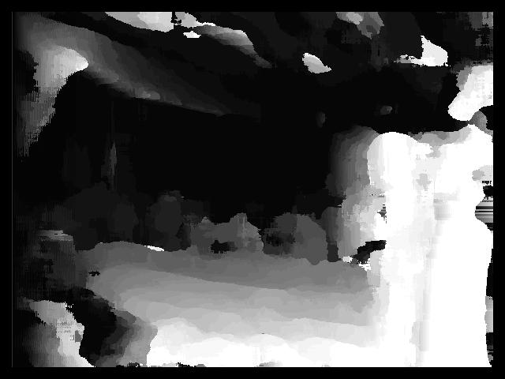

### Different Correspondence Search Ranges
Fix kernel size to 10x10px

10px:
    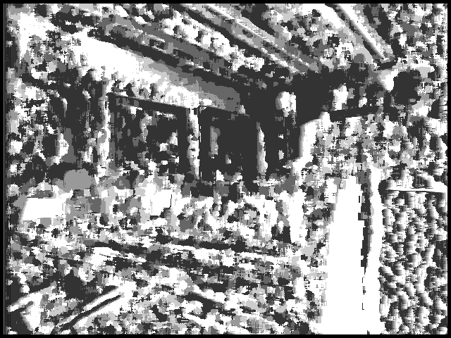
30px:
    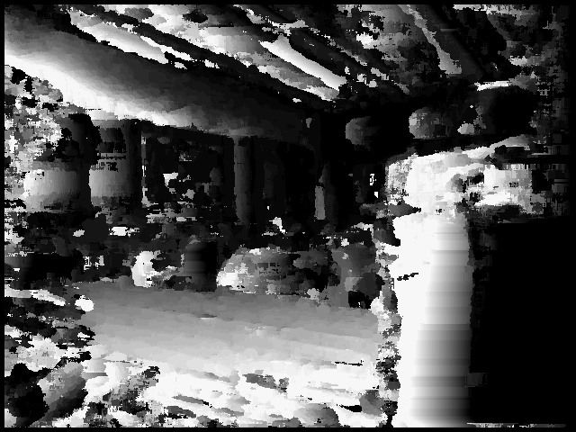
80px:
    
200px:
    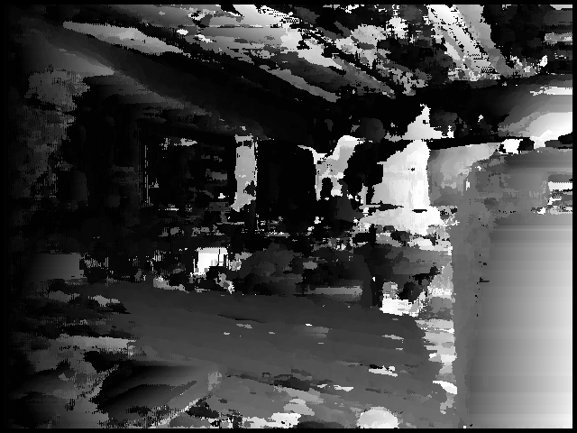
480px:
    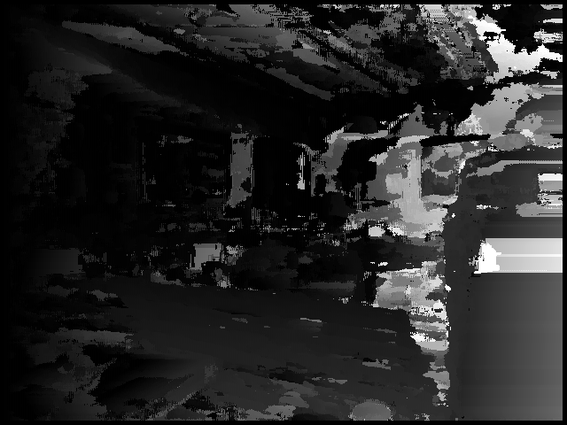

### Other Tests
Raw left image | 15x15 kernel SSD | OAK-D DepthAI

    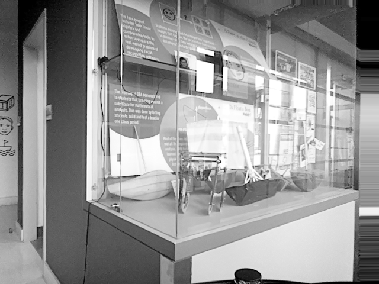
    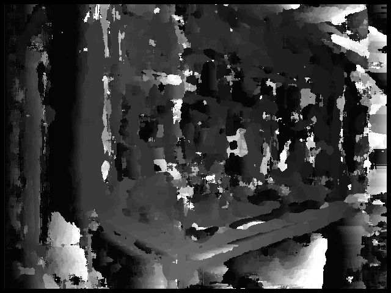
    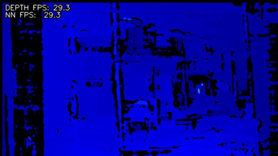

    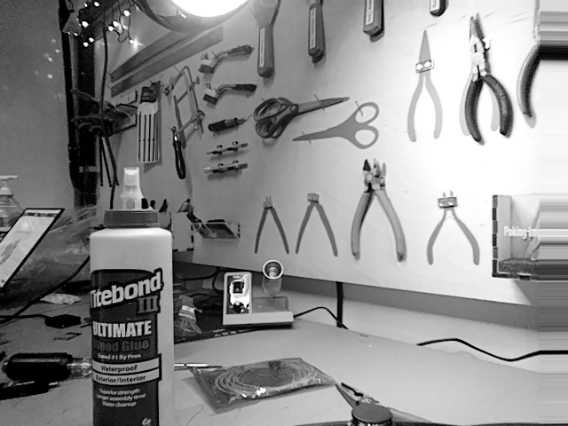
    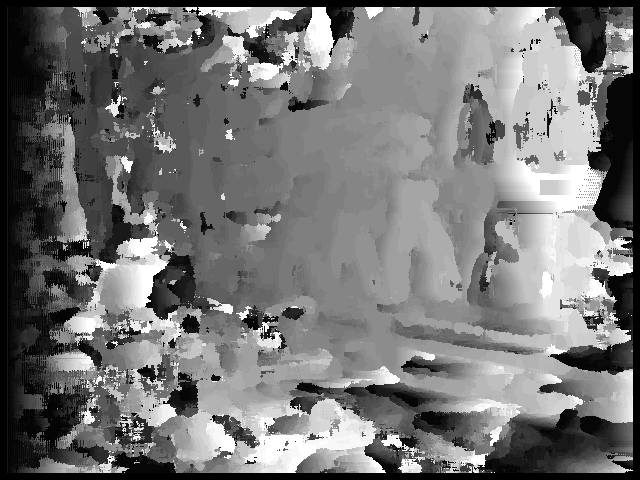
    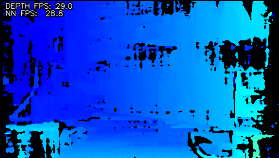

    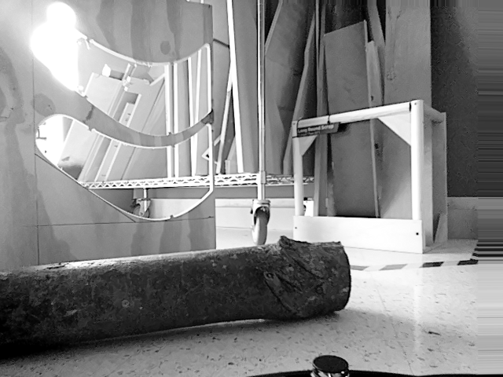
    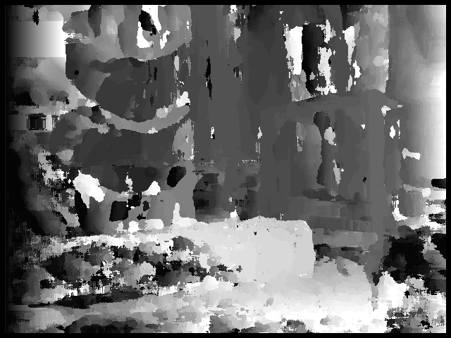
    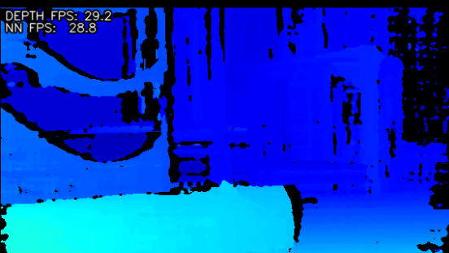

### Challenges

One of the main challenges with this project was with developing a concrete intuition about the camera transformations. A lot of the math was direct to follow, but the corresponding visual interpretation was sometimes challenging to find. One example of this was with the Essential matrix. It was described as being the cross product between the translation vector and the rotation matrix applied to the point in the image plane. Once we understood that the resulting vector was pointing normal to the epipolar plane, it made sense why all the epipolar lines could be computed with the dot product. Additionally, we faced issues with getting images off of the OAKD camera. Due to unknown reasons, the output image stream would randomly stop after a couple of seconds. 

### Improvements

If we had more time, it would have been interesting to validate our understanding of stereo calibration with a real example. In implementation, we took the assumption that the cameras were producing rectified calibrated images, however, we did explore the techniques used to find a least squares solution to an uncalibrated camera system. Additionally, exploring more advanced and modern methods for stereo correspondences might have resulted in faster and more optimal results.

### Lessons
After completing this project, one of the key lessons we found was that a better understanding of the theoretical context and motivation for why a particular method was used makes the application easier to understand. However, much of the detailed theory behind a specific implementation is not actually needed to simply implement the algorithm. For example, the understanding of epipolar geometry was not needed to implement a simple disparity map, but the reasoning for why correspondences exist only on horizontal scan lines and why the depth of a pixel is proportional to the disparity was far clearer after working through the theory.

## Resources
https://web.stanford.edu/class/cs231a/course_notes.html

https://www.youtube.com/playlist?list=PL2zRqk16wsdoCCLpou-dGo7QQNks1Ppzo